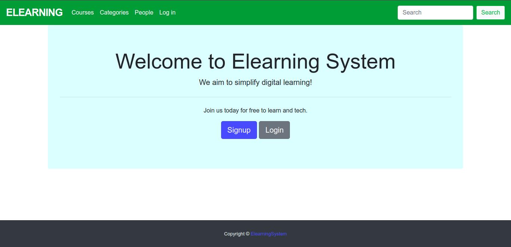
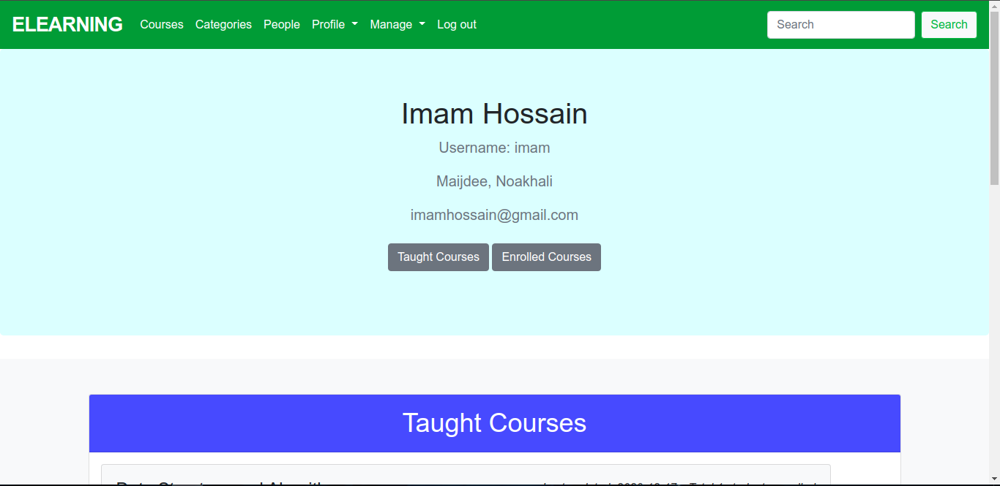
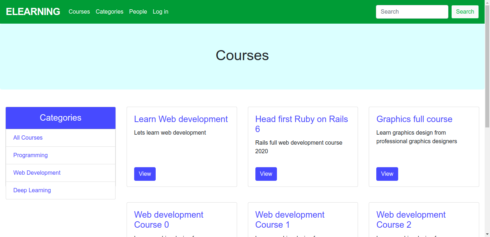
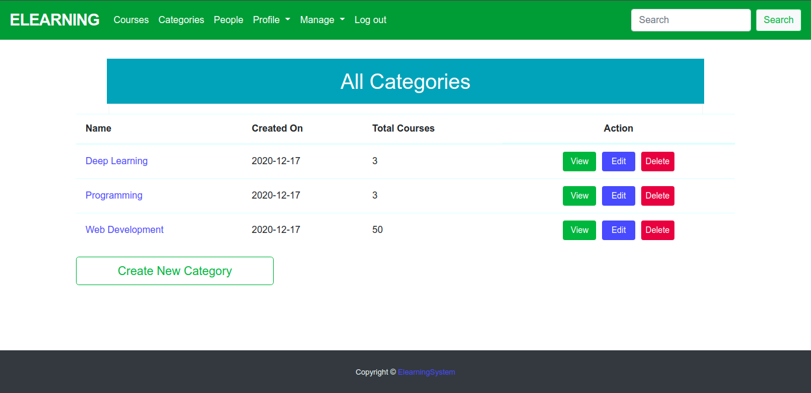
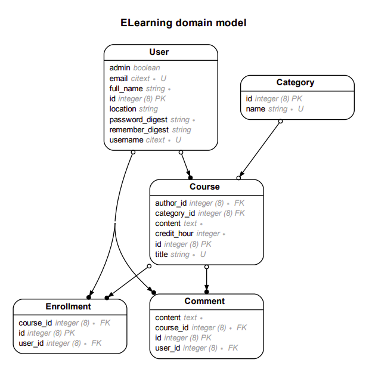

# ELearning System 2020


This is a practice project for learning Ruby On Rails.

In this system, user can create courses and enroll to other user courses.

**Screenshots**

<p float="left" align="center">
  
  
   
  
</p>

## ER Diagram

Entity Relationship Diagram of the project models.

<div align="center">
  

  <p>Elearning System 2020 ERD</p>
  <p>( Generated with <a href="https://github.com/voormedia/rails-erd">rails-erd</a> gem )</p>
</div>

## Run the Project in Development

First we need to setup the Rails environemnt in our system. If you have already setup rails environment, please move to the next section.

**Steps to setup Rails environemnt:**

1. Install Ruby
1. Install Ruby Package Manager ( [rbenv](https://github.com/rbenv/rbenv) (preferred) / rvm )
2. Install Bundler 
3. Setup Postgres SQL Database
4. Setup Git 

Details guide to setup rails environemnt can be found here: https://gorails.com/setup

**Clone the Project**

After finishing the environemnt setup, we need to clone the project locally.
To clone the project, run the following command from terminal

```bash
git clone https://github.com/wtag/juniors-practice-with-github.git
```

or

```bash
git clone git@github.com:wtag/juniors-practice-with-github.git
```

After that, run the following commands from project root directory to get up and running.

**Commands to run rails project locally**

1. `bundle install`
2. `rails db:create`
3. `rails db:migrate`
4. `rails db:seed`
5. `rails server`

Visit: [http://localhost:3000/](http://localhost:3000/)

## Rule Set for PR Reviews

A list of useful rules curated from PR reviews is complied into the following doc. 

[Rule Set for PR Reviews](https://docs.google.com/document/d/1aNOftLWfLr3OdiQLImKY9cJMXqONdHsoRHJ5v34ku0I/edit)

## Commonly Used Rails Commands

- Create New Rails App: `rails new myapp -d postgresql`
- Create Database: `rails db:create`
- Run Migration: `rails db:migrate`
- Seed Database: `rails db:seed`
- Run Server: `rails server`
- Run Server With Port: `rails server --port <portNumber>`
- See Rails Routes: `rails routes`
- Rails Console: `rails c`
- Drop Databse: `rails db:drop`
- Reset Database: `rails db:reset`
- Load Structure SQL: `rails db:structure:load`
- Rollback last migration: `rails db:rollback`
- Run Rspec: `rspec spec`
- Reset seed: `rails db:seed:replant`
- Rails Databse Console: `rails dbconsole`

## Useful Resources

- [Ruby API](https://rubyapi.org/)
- [Rails API](https://api.rubyonrails.org/)
- [Better Specs](https://www.betterspecs.org/)
- [Rails Best Practices](https://rails-bestpractices.com/)
- [Ruby Style Guide](https://github.com/rubocop-hq/ruby-style-guide)
- [Rails Style Guide](https://github.com/rubocop-hq/rails-style-guide)
- [Awesome Rails](https://github.com/gramantin/awesome-rails#readme)
- [Ruby on Rails Design Patterns](https://codeclimate.com/blog/7-ways-to-decompose-fat-activerecord-models/)
